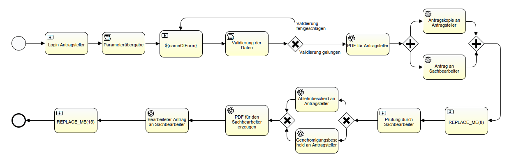

# Generisches Prozessmodell 

## Bedienungsanleitung für das generische Prozessmodell

Das mit dieser Anleitung zur Verfügung gestellte ***generische Prozess*** soll vor allem kleinen Kommunen helfen 
Anträge im Sinne des [OZG](https://www.it-planungsrat.de/SharedDocs/Downloads/DE/Entscheidungen/26_Sitzung/TOP2_Anlage_OZGUmsetzungskatalog.pdf?__blob=publicationFile&v=4)
zu digitalisieren. 

Der hier beschriebe Prozess, wurde nach einem Bottom-Up Prinzip entwickelt. Hierbei wurden Anforderungen von Kommunen mit 
bis zu 20.000 Einwohnern gesammelt und in ein Prozessmodell umgewandelt. 

Um Nutzern die Bedienung zu erleichtern, wurde der Einsatz dieses generischen Prozessmodells anhand der 
Gewerbeanmeldung beschrieben. 

Nach dem erfolgreichen Bearbeiten dieser Anleitung sollten Sie folgende Punkte beherrschen:
- Anfertigung von Formularen.
- Versenden von Formularen an verschiedene Benutzer.
- Erstellung von Abschlussseiten.
- Erstellung von PDF Formularen.
- Validierung verschiedener Daten.
- Erstellung einer für den Sachbearbeiter passenden Sicht.
- Versendung und anpassung von Bescheiden.

CHECKLISTE EINBAUEN

Diese Anleitung wurde in drei Teile unterteilt, die aufeinander aufbauen. Um den größten Nutzen aus dieser Anleitung zu 
ziehen, arbeiten Sie das Dokument bitte sequenziell ab. 

Während sich der erste Teil mit den Voraussetzungen für eine erfolgreiche eingliederung des Prozessmodells 
in ein neues Projekt beschäftigt, deckt der zweite Teil die Erstellung von Formularen ab. 
Im dritten Teil wird das Prozessmodell und dessen Funktionalitäten beschrieben.   

Hier finden Sie die drei Teile:

1. [Voraussetzungen](manual/voraussetzungen.md)
3. [Erstellung eines Formulars](manual/formular.md)
2. [Prozessmodell verstehen](manual/prozessmodell.md)

