# Erstellung eines Formulars

Formulare werden im Formulardesigner erstellt und müssen mit dem Prozessmodell verbunden werden, 
bevor sie funktionieren können.
Die nachfolgenden Schritte erklären wie Sie ein Formular anlegen bzw. 
die vorgefertigten Formulare benutzen können und worauf Sie dabei achten müssen.

## 1. Erstellung eines benutzerdefinierten Formulars

Den Fromulardesigner finden Sie im Admincenter unter der Rubrik 
[Formulare](https://acdev.service-bw.de/admincenter/#!formulare).
Hier müssen Sie ein Formular erstellen.

## 2. Formular anlegen 

1. Nachdem Sie sich im Admincenter eingeloggt haben, halten Sie sich an die Nummer 
***1*** im Bild und navigieren zu 
***Verfahrensmanagement*** --> ***Formulare***.

2. Sie befinden sich nun im Formularreiter, wo Sie den Schritt ***2*** befolgen 
und auf das Feld ***+Anlegen*** klicken müssen.

    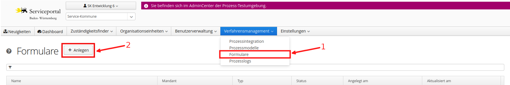

3. Wählen sie einen geeigneten Namen für das Formular aus z.B. (aichtal_gewerbeanmeldung)
    1. Verwanden Sie keine Bindestriche (-)
    2. Verzichten Sie auf Umlaute (ä,ü,ö)
    3. Notieren Sie sich diesen Namen, Sie werden ihn bei der Anbindung an das Prozessmodell brauchen.

4. Navigieren Sie mit der Maus auf das Projekt und klicken Sie die ***Modellierung*** an. Um die vom 
***generischen Prozessmodell*** gegebene Vorlage benutzen zu können, 
importieren Sie das ***generischeFormular-v1.0-de.json***.
Sie finden die Vorlage in dem heruntergeladenen Projekt unter ***forms*** --> 
***generischeFormular-v1.0-de.json***.
Um das Modell zu importieren, drücken Sie auf ***Datei importieren*** und 
wählen die passende Datei aus.
    (Damit Sie die Formulare erweitern können, müssen Sie eigene Felder einfügen. Im  
    ***Abschnitt 2*** wird das Vorgehen genauer beschrieben)
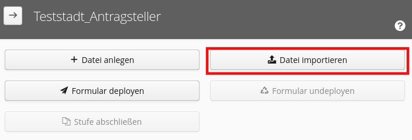

5. ***GRATULATION!!***: Sie haben ein eigenes ein Formular angelegt. 

6. Ergänzend zu den Grunddaten wurden in unserem Beispiel der Gewerbeanmeldung 
die Felder ***Unternehmensname***, ***Unternehmensform*** und ***Kosten der GmbH*** ergänzt. 
Das Feld ***Kosten der GmbH*** wird nur sichtbar, wenn die ***Unternehmensform*** GmbH ausgewählt wird. (Abschnitt 2 erklärt wie eine solche Sichtbarkeitsbedingung funktioniert)

    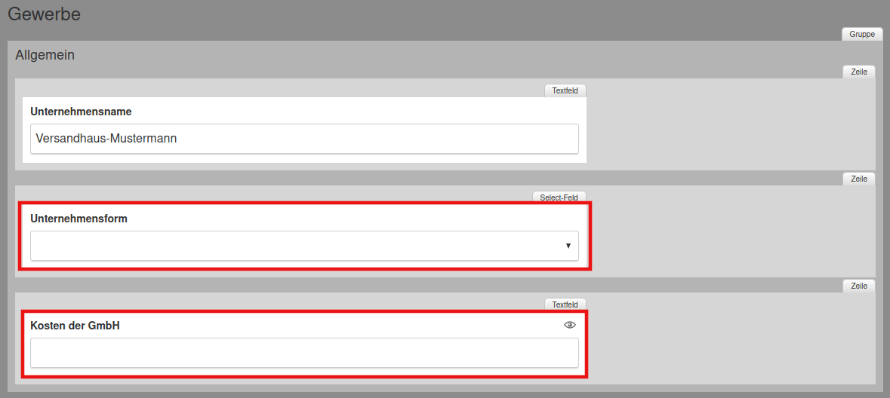

## 2. Formulardesigner verstehen

Damit Sie ein Formular benutzen können, müssen Sie zuerst verstehen wie es funktioniert. 
Dazu im Folgenden einige Punkte:

1. Damit ***Formularmodule*** benutzt werden können, muss im ersten Schritt der mit einer 1 markierte 
***Abschnitt*** in das dunkelgraue Feld gezogen werden. 
Ein Abschnitt entspricht einer Seite im Formular. 
Deswegen bietet es sich an, in einem Abschnitt zusammenhängende Daten abzufragen. 
Abschnitte sollten unbedingt benannt werden, da sonst Ihre Seite keinen Namen hat. 
So wird in unserem Beispiel der Gewerbeanmeldung ein Abschnitt ***Gewerbe*** genannt und der andere 
***Angaben zur Person***. Weiter unten können Sie den Vergleich zwischen dem Formulardesigner und 
einem fertigen Formular sehen.

2. Als Nächstes muss eine Gruppe hereingezogen werden. Es gilt: Ein Abschnitt kann mehrere 
Gruppen beinhalten. So gehören beispielsweise 
die Adressdaten in eine und Bankdaten in eine andere Gruppe. Beide Gruppen können sich in einem 
Abschnitt befinden.

3. Jetzt können auch ***Formularmodule*** (Textfelder, Checkboxen, etc.) verwendet werden. 
Hier gibt es verschiedene Felder zur Auswahl. 

4. Unter dem Punkt 4 auf dem Bild kann das bisher erstellte Formular eingesehen werden. 
Unter dem Punkt Visualisierung der Hierarchien wurde ein direkter Vergleich zwischen 
der Ansicht im Designer und der Formularansicht aufgeführt. 
Hier können Sie einen neuen Abschnitt sehen, in dem die 
Felder ***Unternehmensname*** und ***Unternehmensform*** ergänzt wurden.

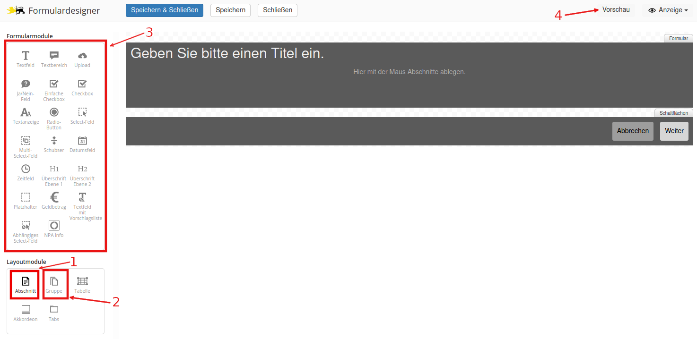
--------------------

### Visualisierung der Hierarchieebenen
Formulardesigner           |  Demonstration fertiges Formular
:-------------------------:|:-------------------------:
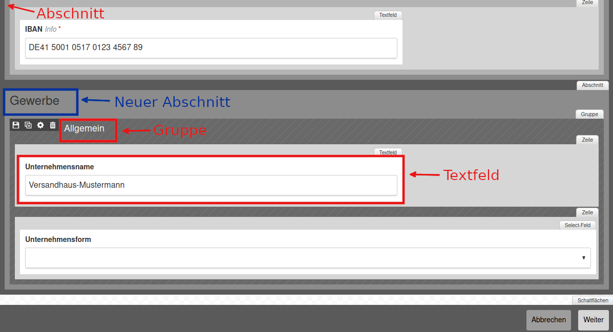  |  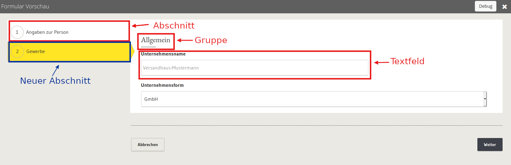

### Hierarchieaufteilung in einem Formular

Generell lässt sich die Hierarchie eines Formulars wie folgt beschreiben:
- Abschnitte 
    - Feldgruppen
        - Zeilen
            - Textfelder

In den Zeilen können Textfelder, Tabellen und Akkordeons angelegt werden. 

### Feldeigenschaften

Jedes Feld, ob es sich um ein Textfeld oder eine Checkbox handelt, besitzt Eigenschaften, 
die mit einem doppelklick auf das gewünschte Feld bearbeitet werden können.
 
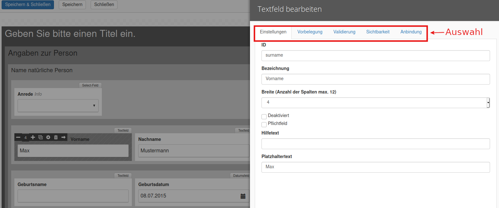

1. Einstellungen: 
    1. Mit der ***ID*** kann das Feld später im Prozess erkannt werden. 
    Es ist wichtig, dass jedes Feld eine eigene ID besitzt. 
    Beachten Sie bei der Vergabe der ID die gleichen Regeln wie bei der Benennung des Prozessmodells:
        - Keine Bindestriche (-) 
        - Keine Umlaute 
        - [CamelCase](https://en.wikipedia.org/wiki/Camel_case)
    2. Die ***Bezeichnung*** ist der spätere Anzeigename im Formular. 
    3. Die ***Breite*** bestimmt wie Breit das gegebene Feld sein soll. 
    Die optimale Anzahl der Spalten ist 8.
    4. Im Feld ***Hilfetext*** können Sie eine erklärung des Feldes Einfügen.
    5. Das Feld ***Platzhalter*** zeig einen Beispielwert auf. In unserem Beispiel: Max. 
    6. ***Pflichtfeld*** bestimmt, ob das Feld ausgefüllt werden muss oder nicht.
    5. Die Checkbox ***Deaktiviert*** wird im späteren Verlauf der Anleitung wichtig, 
    wenn ein Sachbearbeiter die Felder 
    einsehen soll aber nicht bearbeiten darf. 
    
    Deaktiviert nicht angekreuzt           |  Deaktiviert angekreuzt
    :-------------------------:|:-------------------------:
    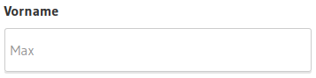  |  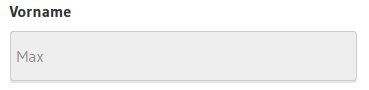
    
2. Vorbelegung:
    1. Die Vorbelegung erlaubt es Felder mit voreingestellten Werten zu belegen. 
    2. Diese Option macht vor allem bei Checkboxen, 
    Select-Feldern oder Radio-Buttons Sinn, da hier Werte von dem 
    Benutzer angeklickt werden und nicht manuell eingetragen. 
    In unserem Beispiel der Gewerbeanmeldung wurden verschiedene 
    Unternehmensformen zur auswahl angeboten.
        
        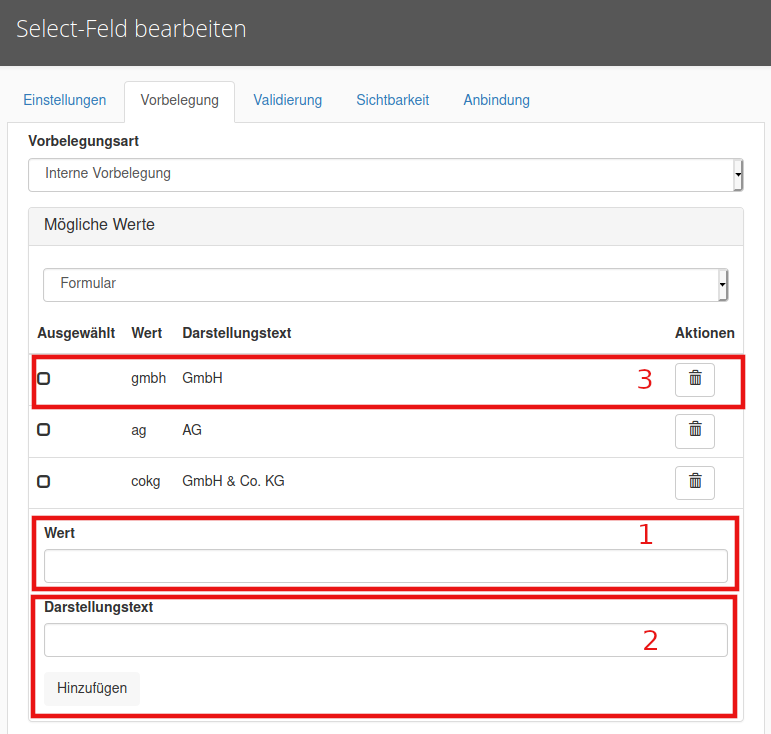
    
3. Validierungsfeld:
    1. Die Validierung wird wichtig, wenn Sie beispielsweise nur Zahlen akzeptieren möchten 
    in einem Textfeld oder Felder bei der Annahme eines bestimmten Wertes zu Pflichtfeldern 
    machen möchten. Die Vorgehensweise für letzteres ist 
    gleich wie bei dem Beispiel von ***Sichtbarkeiten***.
     
        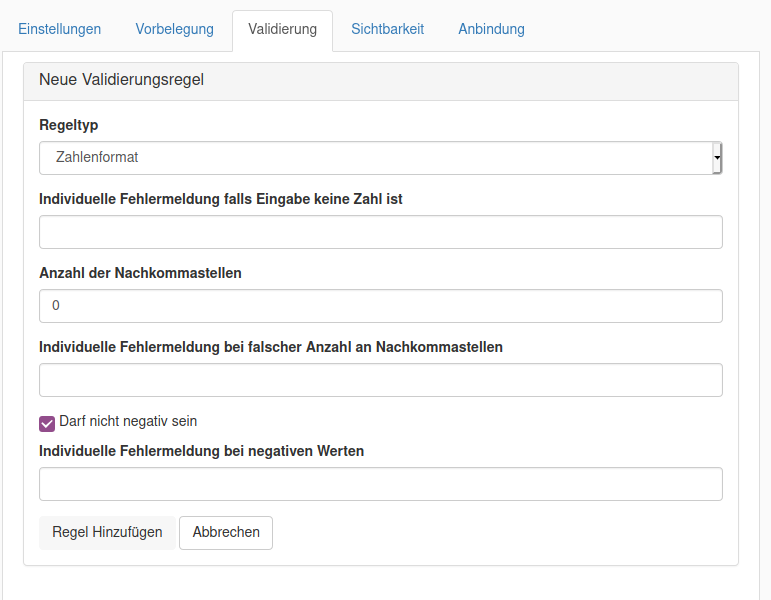 
     
4. Sichtbarkeit:
    1. Mit der Hilfe von Sichtbarkeitsbedingungen können Sie im Formular Felder nur dann 
    anzeigen lassen, wenn andere (von Ihnen bestimmte) Felder einen bestimmten Wert angenommen haben.
    Hier gibt es einige Optionen:
        - Sichtbar wenn Referenzfeld leer
        - Sichtbar wenn Referenzfeld ausgefüllt
        - Sichtbar wenn Referenzfeld Wert hat
        - Sichtbar wenn Referenzfeld Wert nicht hat
        - Sichtbar wenn komplexe Bedingung erfüllt ist

    2. In unserem Beispiel wollen wir das Feld ***Kosten der GmbH*** nur anzeigen, 
    wenn auch die dazu passende ***Unternehmensform*** also ***GmbH*** angegeben wurde. 
    3. Dazu müssen Sie unter der Sichtbarkeit von dem Textfeld ***Kosten der GmbH*** im Dropdown 
    ***Sichtbar, wenn Referenzfeld Werte hat*** auswählen, dann die Feldgruppe, 
    den Feldnamen und den zu berücksichtigenden Wert bestimmen. 
    (Hierdurch lässt sich auch die Wichtigkeit der korrekten Benennung der ID's veranschaulichen. 
    Hätten die Felder Nummern als Wert, wären Sie nicht in der Lage diese so einfach zuzuordnen.)
    
        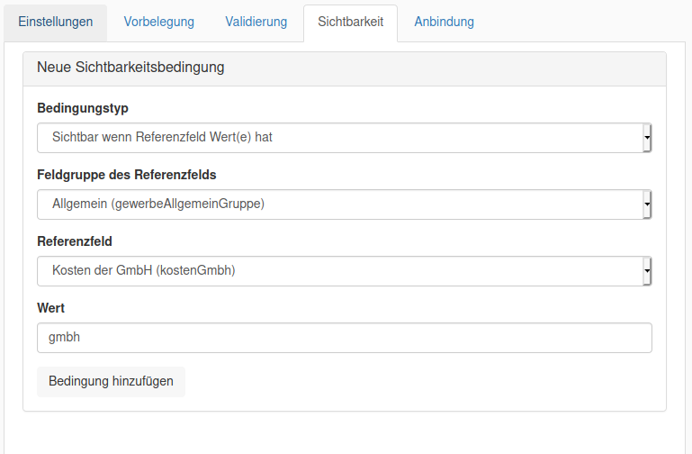 

5. Anbindung:
    1. Mit einem Anbindungstyp kann ein Formular Werte von außerhalb erhalten oder Werte nach 
    Außen mitteilen. Folgende Anwendungsfälle sind besonders wichtig: 
        1. ***Wiedergabe der ausgefüllten Felder in anderen Formularen***
            - Werte eines vom Antragsteller ausgefüllten Formulars 
            sollen einem Sachbearbeiter zur Genehmigung angezeigt werden. 
            - Hierfür muss das oberste Feld des Formulars mit einem Doppelklick aufgerufen und 
            auf die Maske ***Anbindung*** gewechselt werden. 
            Anschließend können Sie einen Namen definieren. 
            (Siehe Schrittabfolge auf dem Bild)
            
                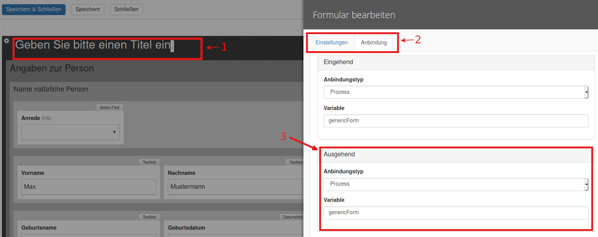
        2. ***Erstellung einer PDF***
            - Hier gilt die gleiche Voraussetzung wie im Schritt ***1***
        3. ***Automatische Felderbefüllung*** 
            -  Eine Anforderung an Formulare von kleinen Kommunen ist das 
            Automatische vorausfüllen der Felder. Das ist auf der Plattform SBW nur bedingt möglich. 
            Sie können Daten, die von dem Antragsteller auf seinem 
            Service-Bw Benutzerkonto selbst hinterlegt wurden, wiedergeben.
            
            Die folgenden Daten lassen sich automatisch wiedergeben:
                        
            Allgemeine Felder | Bürgerkonto Felder | Organisationskonto Felder
            -------- | -------- | --------
            E-Mail   | Anrede   | Rechtsform
            Straße   | Titel   | Art des Registers
            Hausnummer   | Vorname   | Registernummer
            Postleitzahl   | Nachname   | Registerort
            Ort   | Geburtsname   | 
            Land   | Geburtsdatum   | 
            Steuernummer   | Geburtsort   | 
            Festnetznummer 1   | Geburtsland   | 
            Festnetznummer 2   | Geburtslandkreis   | 
            Mobilfunknummer   | Familienstand   | 
            FAX   | Staatsangehörigkeit   | 
            .| Religion   | 
            .   | Personalausweisnummer   | 
            .   | Ausstellendes Land   | 
            .   | Ausweistyp   | 
    
            - Um die automatische Befüllung möglich zu machen, ist es notwendig die gewünschten 
            Felder anzupassen. In unserem Beispiel nehmen wir den ***Vornamen*** des Antragstellers. 
            Dazu müssen Sie auf das Textfeld ***Vorname*** mit einem Doppelklick klicken 
            und auf die Maske ***Anbindung*** wechseln. Anschließend geben Sie folgende Werte ein:
    
                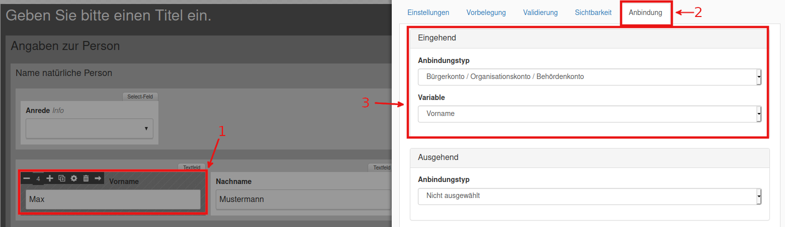
            
            - Eine solche befüllung ist dabei nur möglich, wenn der Antragsteller diese Funktion freigeschaltet hat.
                Hierfür muss der Antragsteller sich in sein Servicekonto einloggen, in der rechten oberen Ecke auf sein
                Profil klicken und bei ***Kontoverwaltung*** --> ***Profildaten Freigeben*** --> 
                ***Profildaten permanent für elektronische Verfahren freigeben*** einen Hacken setzen.
                Abschließend muss das ganze gespeichert werden.
        
    Sie können auf der Grundlage dieser Erklärung weitere Formularfelder einfügen und so Ihr eigenes
    Formular erstellen.

## Haben Sie das Formular fertiggestellt?
 
 ***Falls ja, dann fahren Sie mit der Anleitung [Voraussetzungen](../manual/voraussetzungen.md) 
 unter Punkt 6 fort.***

