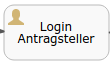

# Aufbau des generischen Prozessmodells

Dieser Teil der Anleitung findet ausschließlich im Prozess-Modeller statt. Diesen finden Sie, wenn 
sie unter ***Verfahrensmanagement*** --> ***Prozessmodelle*** und auf ***Datei bearbeiten*** unter der 
technischen Modellierung klicken. 

## 1. Login Antragsteller 



Damit der Antragsteller ein Antrag erfolgreich ausfüllen kann, ist ein Login bzw. eine Registrierung notwendig. 
Dadurch kann dieser Antragsteller mit dem zuständigen Sachbearbeiter kommunizieren.

## 2. Benennung der Prozessinstanzvariablen 


Da einige Werte mehr als einmal vorkommen, wurden diese zentral in einem Skript-Task durch Prozessinstanzvariablen 
festgehalten. Damit der Prozess laufen kann, müssen Sie diese Variablen umbenennen.
Dazu sind folgende Schritte notwendig:
1. Klicken Sie auf den Service-Task ***Parameterübergabe***
2. Suchen Sie nach dem Feld ***Script***

    
3. Klicken Sie dieses Skript an.
4. Ersetzen Sie die ***REPLACE_ME*** Felder mit den folgenden Werten:
    - ***REPLACE_ME(2)***: Fügen Sie die ID des Sachbearbeiters ein, der dieses Formular zukünftig bearbeiten soll.
        - Sie finden die Nummer, wenn Sie im Admincenter auf Ihr Profil navigieren und auf 
        ***Rechte & Benutzergruppen anzeigen*** klicken.
        
        - Anschließend kopieren Sie die IDP-ID: 
        
        - Setzen Sie das Signalwort ```userId:``` vor die ID und fügen es an die dafür vorgesehene Stelle ein.
        - In unserem Beispiel ist es:
        
            ```groovy
            String responsibleCaseworkerId = "userId:774513872970"
            ```
        
    - ***REPLACE_ME(3)***: Hier fügen Sie den Namen ein, der bei der Antragstellung zu sehen sein soll. 
        - In unserem Beispiel: 
        
            ```groovy
            String titleOfForm = "Gewerbeanmeldung"
            ```

    ```groovy
    package generischesProzessmodell
    
    import org.activiti.engine.delegate.DelegateExecution
    
    
    DelegateExecution execution = execution
    
    // Defining caseworker who receives messages and approves Form
    // Replace 'REPLACE_ME(2)' with userId:<ID_of_caseworker>
    String responsibleCaseworkerId = "REPLACE_ME(2)"
    
    // Replace 'REPLACE_ME(3)' by the name of the Form
    String titleOfForm = "REPLACE_ME(3)"
    
    
    execution.setVariable("responsibleCaseworkerId", responsibleCaseworkerId)
    execution.setVariable("nameOfForm", titleOfForm)
    ```
    
5. Um eine wiederholte Eingabe zu vermeiden, wurde nun die ID des Sachbearbeiters und der Name des Formulares
in den Variablen ```responsibleCaseworkerId``` und ```titleOfForm``` hinterlegt. Sie können diese variablen innerhalb
des Prozessmodells weiterverwenden, indem Sie die beiden Variablen in dieser Form: ${titleOfForm} an den passenden 
 Stellen unter Expressions angeben. 
So kann die Variable ***nameOfForm*** nicht nur für die Überschrift des Antrags verwendet werden, sondern auch im 
Betreff der Nachricht wiedergegeben werden in der Form ${nameOfForm}. 


## 3. Benutzung des Formular-Tasks


Die Anbindung wurde in den [Voraussetzungen](../manual/voraussetzungen.md) bereits näher erklärt. 

## 4. Validierung verschiedener Daten


Dieser Funktionsbaustein beschäftigt sich mit der Validierung der Daten. Wie bereits 
bei dem Script-Task ***Parameterübergabe***, müssen Sie auch hier auf das Feld ***Script*** navigieren. 
Hier können Sie unterschiedliche Validierungen durchführen. Dazu müssen Sie jeweils den passenden Code in die dafür 
vorgesehenen Stellen einfügen. Die Stelle an der eine Validierung eingefügt werden soll, ist mit
 ```// <bezeichnung der Validierung> start``` für den Beginn und ```// <bezeichnung der Validierung> end``` für das 
 Ende markiert.

Bei der Validierung der Daten haben Sie mehrere Optionen zur auswahl:
 - Validierung der IBAN
    - Den Code für die Validierung der IBAN finden Sie unter [IBAN-Validation](scripts/IBANValidation.groovy)
 - Validierung des Alters ***bis*** zu einer gewissen Altersgrenze
    - Der Code für die Validierung des maximal zulässigen Alters ist in [MaximumAgeValidation](scripts/MaximumAgeValidation.groovy) 
    hinterlegt.
 - Validierung des Alters ***ab*** einer gewissen Altersgrenze
    - Der Code für die Validierung des minimal zulässigen Alters ist in [MinimumAgeValidation](scripts/MinimumAgeValidation.groovy) 
        hinterlegt.
 - Validierung der Postleitzahlen im eigenen Zuständigkeitsbereich.
    - Der Code für die Validierung der Postleitzahlen ist in [PostalCodeValidation](scripts/PostalCodeValidation.groovy)
    hinterlegt.
 
 Um eine solche Validierung durchführen zu können, müssen Sie den gesamten Code der für Sie benötigten Validierung 
 an die dafür vorgesehene Stelle im Skript kopieren.
 Beachten Sie dabei, dass ***entweder*** bis zu einer Altersgrenze ***oder*** ab einer Altersgrenze validiert werden kann.
 Es dürfen nicht beide eingefügt werden, da sonst das die Validierungen sich gegenseitig am Fortfahren stören.
 
 
### Aufbau

Bei der Validierung der Daten gibt es ein festes Codesegment, welches bereits im Skript enthalten ist.
Dieses Codesegment darf nicht verändert werden.

```groovy
import de.seitenbau.serviceportal.formulare.api.FormContent
import de.seitenbau.serviceportal.formulare.api.FormFieldContent
import de.seitenbau.serviceportal.prozess.scripttask.ProzessParameterReader
import org.activiti.engine.delegate.DelegateExecution

DelegateExecution execution = execution

// Calling form by 'genericForm' and put it into the variable 'applicationForm'
FormContent applicationForm = execution.getVariable("genericForm") as FormContent

// Setting 'isFormValid' to true
// So If there are no issues, the process will continue to the next step
execution.setVariable("isFormValid", true)

```

1. ***Validierung der IBAN***
    1. Für die Validierung der IBAN muss das Iban Feld welches Sie Validieren möchten ***bankIBAN*** heißen. 
    Das Feld ist in dem vorgefertigten Skript bereits enthalten. 
    2. damit die IBAN Validiert werden kann, müssen Sie das folgende zwischen ```// IBAN validation start```
    und ```// IBAN validation end``` den gesamten Code aus der Datei [IBAN-Validation](scripts/IBANValidation.groovy) 
    einfügen.

2. ***Validierung des Alters ***bis*** zu einer gewissen Altersgrenze***
    1. Damit diese Validierung gelingt, muss das Altersfeld die ID ***birthDate*** besitzen.
    
    2. Hier müssen Sie den gesamten Code aus [MaximumAgeValidation](scripts/MaximumAgeValidation.groovy)
     zwischen die Zeilen ```// birthDate validation maximum age start``` und 
    ```// birthDate validation maximum age end``` eingefügt werden. 
    
    3. Für eine korrekte Funktionsweise müssen Sie
    ***REPLACE_ME_BY_NUMBER*** durch ein Alter ersetzen, welches nicht überschritten werden soll. In unserem Beispiel 
    wird das 18 Lebensjahr genommen.
    ```groovy
    // Have to be replaced by the desired minimal age that shall be allowed
    int maximumAgeAllowed = REPLACE_ME_BY_NUMBER
    ```
    
    ```groovy
    // Person has to be younger than 18
    int maximumAgeAllowed = 18
    ``` 
   
3. ***Validierung des Alters ***ab*** einer gewissen Altersgrenze***

    1. Genau wie bei der Validierung zuvor muss das Feld welches Sie validieren möchten die ID ***birthDate*** besitzen.
    
    2. Hier müssen Sie den Code aus der Datei [MinimumAgeValidation](scripts/MinimumAgeValidation.groovy) 
    zwischen die Zeilen ```// birthDate validation minimum required age start``` und 
       ```// birthDate validation minimum required age end``` eingefügt werden. 
    
    3. Für eine korrekte Funktionsweise müssen Sie
       ***REPLACE_ME_BY_NUMBER*** durch ein Alter ersetzen, welches mindestens erreicht sein soll. In unserem Beispiel 
       wird eine 25 genommen.
       ```groovy
        // Have to be replaced by the desired minimal age that shall be allowed
        int minimumAgeAllowed = REPLACE_ME_BY_NUMBER
        ```
       ```groovy
       // Person has to be older than 25
       int minimumAgeAllowed = 25
       ```

4. ***Validierung der Postleitzahlen im eigenen Zuständigkeitsbereich***

    Nachfolgend können Sie Postleitzahlen validieren. Dafür müssen Sie die 
    Postleitzahlen selbst in eine Datei schreiben und durch den nachfolgenden Code validieren lassen. 
   
    Hierfür können Sie eine ***.csv*** Datei in einem bestimmten Format hochladen und somit beispielsweise den 
    Zuständigkeitsbereich eingrenzen. Für dieses Unterfangen wurde der Prozessparameter ```validZipCodeCsv``` definiert.
    Hier Finden Sie das Vorgehen zur validierung von Postleitzahlen:
    
    1. Als Erstes müssen Sie den für die Validierung notwendigen Code aus der Datei 
    [PostalCodeValidation](scripts/PostalCodeValidation.groovy) an die dafür vorgesehene Stelle kopieren. 
    Die dafür vorgesehene Stelle beginnt mit ```// PLZ validation start``` und endet mit
    ```// PLZ validation end```.
        
    2. Erstellen Sie eine ***.csv*** Datei. 
    Laden Sie die Datei [validZipCodeCsv](../manual/validZipCodeCsv.csv) herunter und befüllen sie mit eigenen Angaben.
    Verändern Sie nicht die Reihenfolge oder Rechtschreibung der Felder, da sonst die Validierung fehlschlägt.
    Geben Sie die für Sie relevanten Postleitzahlen ein und speichern die Datei wieder als ```.csv``` ab. 
    
    Sie können diese Datei auch selbst in Excel erzeugen. Dazu ist es wichtig die erste Zeile identisch zu übernehmen.
    Nachdem Sie das Format übernommen haben, können Sie in Excel eine CSV-Datei wie Folgt erstellen:

    
        
    1. Drücken Sie auf ***Datei speichern unter...***.
    
    2. Speichern Sie die Datei wie im Bild beschrieben ab.
        
        
    3. Nachdem Sie die Datei abgespeichert haben, müssen Sie sichergehen, dass der Prozess deployt ist.
     Details finden Sie weiter unten, unter der Überschrift ***Prozess deployen***
     
    4. Wenn die vorherigen Punkte erfüllt wurden, navigieren Sie im Admincenter auf 
    ***Zuständigkeitsfinder*** --> ***Prozesse*** und klicken auf den von Ihnen erstellten Prozess. 
    (Vorgehen siehe Bild)
    
    
    5. Nachdem Sie schritt 1 in der unten stehenden Grafik befolgt haben, sollten Sie das ausgegraute Fenster auf 
    der rechten Seite vorfinden. 
    
    6. Laden Sie nun Ihre ***validZipCodeCsv.csv*** Datei hoch und Speichern Sie sie ab. 
    
    
    7. Sie sollten nun in der Lage sein Postleitzahlen zu validieren.

## 5. PDF-Erzeugen

In unserem Beispiel füllt ein Antragsteller einen Gewerbeantrag aus. Anschließend soll ein Sachbearbeiter diesen Antrag 
prüfen und genehmigen oder anlehnen. Der bewertete Antrag soll dem Sachbearbeiter als Kopie zur Verfügung gestellt werden.
Hierfür wurden zwei PDF-Dateien erzeugt. Einmal die für den Antragsteller und einmal für den Sachbearbeiter.
Hierfür sind die veranschaulichten Funktionsbausteine vorgesehen:

PDF an Für           |  PDF für Sachbearbeiter
    :-------------------------:|:-------------------------:
      |  


Ein Service-Task ist ein Funktionsbaustein, der mit einem Zahnrad gekennzeichnet ist. Damit können verschiedene 
automatische Funktionen ausgeführt werden. 
Um eine PDF-Datei zu erzeugen, brauchen Sie die ausgehende Anbindung des von Ihnen erstellten Formulars. 
Informationen hierzu finden Sie in der Anleitung zum [anlegen eines Formulars](../manual/formular.md) unter
dem Punkt ***Feldeigenschaften*** ***Nummer 5***. Das generische Prozessmodell erledigt diese Erzeugung bereits automatisch.
Für das bessere Verständnis wird im Folgenden erklärt, welche Schritte notwendig sind um eine solche PDF-Datei zu erzeugen.

1. Dazu muss der Entwickler auf den gegebenen Task navigieren.
2. Zum Erstellen einer PDF-Datei muss (wie auf dem Bild unter Punkt 2) in das Feld ***Class*** der Wert 
    ```
    de.seitenbau.serviceportal.prozess.servicetask.PdfErstellenService
    ``` 
    eingefügt werden. Damit lösen man die 
    Erzeugung aus. 
    
    
    
3. Damit das Prozessmodell weiß, was es umwandeln soll und unter welchem Namen es später zu finden ist, müssen die 
Felder ***source*** und ***target*** erstellt und befüllt werden.
    1. Mit einem ***+*** können solches Feld hinzufügt werden. 
    2. ***source***: Muss übernommen werden und genau so in das Feld 'Name' eingefügt werden.
    3. Mit den entsprechenden Klammern ```${}``` muss die ausgehende Anbindung übernommen werden. In unserem Beispiel 
     heißt die ausgehende Anbindung 'genericForm' und muss in der form ```${genericForm}``` in das Expression Feld 
     übertragen werden. 
    4. Diese Schritte müssen für ***target*** wiederholt werden. Hier fügen Sie einen Namen ein, 
    unter dem die PDF-Datei später an den Antragsteller gesendet werden soll.
    
    

## 6. Nachrichten anpassen und versenden


Das Versenden von Servicekontonachrichten wird auf Service-Bw mit einem Service-Task realisiert. Damit eine solche
Nachricht an verschiedene Personen versendet werden kann, muss der Service-Task eine Java-Klasse importieren, die es
möglich macht. Dazu muss zu dem Funktionsbaustein ***Antragskopie an Antragsteller*** unter dem Punkt ***Class*** 
eine dafür vorgesehene Klasse hineinkopiert werden. Diese Klasse können Sie hier kopieren:

```groovy
de.seitenbau.serviceportal.prozess.servicetask.NachrichtAnMSBWService
```

Bei der Versendung einer Nachricht müssen Adressaten, Betreff, Inhalt und mögliche
Anhänge bestimmt werden. Die folgenden Schritte erklären das Vorgehen an einem Funktionsbaustein. Dieses Vorgehen können
Sie dann auf andere übertragen. Die Versendung findet in folgenden Funktionsbausteinen statt: 
***Antragskopie ab Antragsteller***, ***Ablehnbescheid an Antragsteller***, ***Genehmigung an Antragsteller*** 
***Antragskopie an Antragsteller*** und ***Bearbeiteter Antrag an Sachbearbeiter***.

1. Klicken Sie den Task ***Antragskopie an Antragsteller***. 
2. Suchen Sie das Feld ***Class Fields*** und klicken Sie es an.
    
3. Ersetzen Sie die ***REPLACE_ME*** stellen und personalisieren somit Ihre Nachricht an die Antragsteller. 
nachfolgend werden die namen der 'Class fields' erklärt. Hier müssen nur die ***REPLACE_ME*** Stellen des jeweiligen Tasks
 ersetzen. Vorgesehen sind dafür ***REPLACE_ME(5, 6, 7, 8)***

    
    
    - ***empfaengerId***: Hiermit kann der empfänger der Nachricht eingestellt werden. Der bereits voreingestellte Wert  
    ***${startedBy}*** sendet eine Nachricht an den Antragsteller. Soll eine stattdessen Nachricht an einen
     Sachbearbeiter versendet werden, so muss dieser Wert durch ***${responsibleCaseworkerId}*** ersetzt werden und diese
     entsprechend angepasst werden.
     
     - ***betreff***: Dieses Feld gleicht einem Betreff einer E-Mail. In diesem Feld können Sie mit 
     ***${titleOfForm}*** auch den Namen des Antrages angeben, wenn dieser zuvor im Skript-Task ***Parameterübergabe***
      definiert wurde.
      
     - ***text***: Ermöglicht eine Nachricht, die an den im ***empfaengerId*** bestimmten Benutzer versendet wird.
        Die Nachrichten können mit direkten Verlinkungen versehen werden. Hierbei können Sie diese einfach kopieren und
        an die gewünschte Stelle einfügen.
        
        Empfehlenswert für den Antragsteller:
        - ***{{STARTSEITE}}***
        - ***{{POSTFACH}}***
        - ***{{ANTRAEGE}}***
        - ***{{ANLIEGEN}}***
        
        Empfehlenswert für den Sachbearbeiter:
        - ***{{BEWERBUNGEN}}***
        - ***{{AUFGABENLISTE}}***
        - ***{{LINK_AUF_AKTUELLEN_PROZESS}}*** --> Beim Einfügen dieser Passage, kommt ein Sachbearbeiter direkt auf den 
        Antrag den Sie erstellen. 
     - ***anhaenge***: Der im Vorfeld erstellte PDF Antrag kann hier als Anhang mitgegeben werden. In unserem Beispiel 
     wurde der Antrag ***pdfAntrag*** genannt. Um diesen hier benutzen zu können, muss dieser wieder als Expression 
     angegeben werden: ```${pdfAntrag}```
    
    
    
### 8. Abschlussseiten


Nachdem der Antragsteller einen Antrag bearbeitet hat, möchte er für gewöhnlich erfahren ob dieser eingegangen ist. 
Hierfür wurden auf der Plattform Service-Bw Abschlussseiten erstellt. Diese Abschlussseiten zeigen eine von Ihnen 
definierte Nachricht einmalig an (siehe Bild).
Gekennzeichnet sind solche Nachrichten mit einem ***showOnce*** welches in den Eigenschaften unter ***Form Key*** 
mitgegeben wird.
Das generische Prozestsmodell verfügt über zwei solcher ***showOnce*** Funktionsbausteine. 
In dem ersten ***REPLACE_ME(9)*** wird eine Abschlussseite für den Antragsteller konstruiert. Das zweite 
***REPLACE_ME(13)*** dagegen bestätigt dem Sachbearbeiter den bearbeiteten Antrag.

REPLACE_ME(9) und (10)           |  Im Antragsprozess
    :-------------------------:|:-------------------------:
      |  
      |

Für die Implementierung eines solchen Funktionsbausteins befolgen Sie die kommenden Schritte:
1.  Klicken Sie den User-Task REPLACE_ME(9) an. 
2. Ersetzen Sie das REPLACE_ME(9) durch eine von Ihnen bevorzugte Abschlussnachrichten Überschrift. Im Bild weiter 
unten können Sie sich Anschauen wie, eine solche Nachricht aussieht. 
In unserem Beispiel ist es der Antragsteller, deswegen wieder ```${startedBy}```.
3. Erstellen Sie eine benutzerdefinierte Nachricht, indem Sie auf das Feld ***Documentation*** klicken und das
 REPLACE_ME(10) ersetzen.
Neben einem herkömmlichen Text können Sie Verlinkungen zu der Startseite oder dem Postfach machen. Hierfür können Sie
 zwischen folgenden Optionen wählen:
    - ***{{STARTSEITE}}***
    - ***{{POSTFACH}}***
    - ***{{ANTRAEGE}}***
    - ***{{ANLIEGEN}}***
    - ***{{BEWERBUNGEN}}***
    - ***{{AUFGABENLISTE}}***


### Das generische Prozessmodell wurde nun erklärt. Bitte fahren Sie mit der [Voraussetzungen](../manual/voraussetzungen.md) fort.


