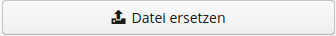
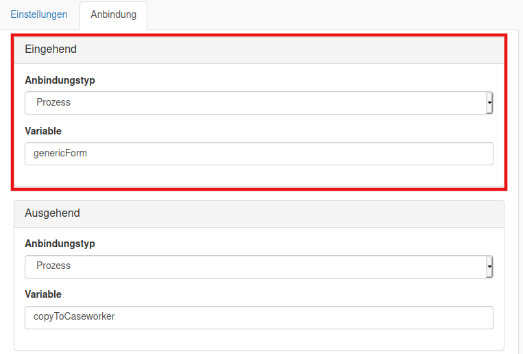

# Voraussetzungen 

In diesem Kapitel werden die notwendigen Schritte beschrieben bis zu einer erfolgreichen Implementierung des 
generischen Prozessmodells.

## 1. Herunterladen des generischen Prozessmodells

Nachdem Sie die das generische Prozessmodell heruntergeladen haben, müssen Sie auf ***model*** --> 
***generischesProzessmodell.bpmn20.xml*** navigieren. 

## 2. Ein neues Projekt Anlegen

Im nächsten Schritt legen sie ein neues Projekt an. 
Dazu gehen sie wie folgt vor: 

1. Loggen sie sich hierfür im [Admincenter](https://admincenter.service-bw.de/admincenter/) ein.

2. Wählen Sie den passenden Mandanten für Ihre Kommune aus. In unserem Beispiel ist es der ***Service-Kommune*** Mandant.
Jede Kommune in Baden-Württemberg hat einen eigenen Mandanten. Hierfür geben Sie den Namen Ihrer Kommune einfach in das
auf dem Bild dargestellte Feld ein. Dieses befindet sich oben links auf der Seite.

    

3. Um ein Prozessmodell anzulegen, müssen Sie nun auf den Reiter ***Verfahrensmanagement*** klicken und die Option 
Prozessmodelle auswählen.


4. Legen Sie nun ein neues Prozessmodell an, indem Sie den Button ***+ Anlegen*** betätigen.
Benutzen Sie folgende 
Namenskonvention: Stadt - Antragsprozessname. z.B. Musterstadt - Hallenreservierung.

5. Bevor sie zu der ***technischen Modellierung*** gelangen, müssen sie erst die ***fachliche Modellierung*** 
freigeben. 
    1. Dazu klicken auf ***v1.0*** --> ***Fachliche Modellierung***, dann auf den Button ***+ BPMN Modell anlegen*** 
    und legen ein neues Prozessmodell an. 
    2. Benennen das Modell mit folgender Namenskonvention: 
        - Der Name sollte in [CamelCase](https://en.wikipedia.org/wiki/Camel_case) geschrieben werden, 
        also z.B.: aichtalGewerbeanmeldungsProzess
        - Vermeiden Sie Umlaute (ä,ö,ü) 
        - Vermeiden Sie Bindestriche
    3. Klicken Sie auf ***Datei freigeben***
    4. Kehren Sie zurück auf das Feld ***Fachliche Modellierung*** und drücken ***Stufe abschließen***. Bestätigen Sie  
    das Dialogfenster, indem Sie auf ***weiter*** klicken.
    5. Sie sollten jetzt bei der technischen Modellierung ein Prozessmodell erhalten mit demselben Namen.


6. Wenn Sie im Reiter ***technischen Modellierung*** angelangt sind, navigieren Sie auf das vorhandene Prozessmodell
und klicken auf .
Ersetzen Sie das vorhandene Modell mit dem generischen Prozessmodell. 

7. Dazu fügen Sie das heruntergeladene Modell mit der .bpmn20.xml endung ein. 
***generischesProzessmodell.bpmn20.xml***

8. Nach der Auswahl des generischen Prozessmodells drücken Sie auf ***Speichern***.

9. Nach der Speicherung müssen Sie den kopierten Namen einfügen, sodass sowohl in der ***fachlichen*** als auch in der 
***technischen*** ***Modellierung*** der gleiche Name gegeben ist. 
 
10. Das Prozessmodell ist jetzt importiert. 

## 3. Mandanten ID ermitteln

Die Mandanten ID brauchen Sie um das Prozessmodell Ihrem Mandanten zuzuordnen. Sie kann ermittelt werden, in dem Sie 
auf der Hauptseite des Admincenters auf ***Organisationseinheiten*** --> ***Organisationseinheiten*** navigieren und 
Ihren Mandanten anklicken.


## 4. Verknüpfung zum Projekt erstellen

Das ***generische Prozessmodell*** wurde jetzt zwar erfolgreich importiert, damit es jedoch funktionieren kann, muss
es für Ihren Antragsprozess angepasst werden. 
Hierzu sind weitere Einstellungen notwendig. 
Dazu navigieren Sie auf Ihr Projekt ***technische Modellierung*** --> ****<ihr_erstellter_prozess*** --> 
***Datei bearbeiten***. in unserem Beispiel:

 

Sie befinden sich nun im ***Prozessmodeller***.  
Ändern Sie folgende Daten ab:
1. ID des Prozesses
    - Sie müssen nun die ID und den Anzeigenamen des Prozessmodells abändern damit das Programm das 
    ***generische Prozessmodell*** als Ihr Projekt erkennen kann.
    - Wenn Sie auf ***Datei bearbeiten*** geklickt haben, befinden Sie sich nun im Prozessmodeller. Hier finden Sie 
    im unteren Bereich der Maske die Einstellungen.  
    -  Die im Bild mit der ***1*** gekennzeichnete ID des Prozessmodells besteht aus der Kennung m, 
    Ihrer Mandanten ID und den für das Prozessmodell vergebenen Namen. 
       In unserem Beispiel ist es: Kennung m + Mandanten ID: 6000357  + Name: aichtalGewerbeanmeldungsProzess
       = m6000357.aichtalGewerbeanmeldungsProzess
       
2. Änderung des Anzeigenamens vom eingefügten generischen Prozess
    - Das im Bild mit der ***2*** versehene Feld ist der Anzeigename des späteren Prozesses. 
    Sie können diesen nach Belieben verändern. Hier gilt keine Namenskonvention. In unserem Beispiel wird der 
    Anzeigename lauten: Aichtal - Gewerbeanmeldung 
    

    
Nachdem diese beiden Daten verändert wurden muss das Prozessmodell noch gespeichert werden. Dazu klicken Sie oben auf
das Speichern Feld, welches mit einer Disk gekennzeichnet ist. Der Name unter dem sie dieses Prozessmodell abspeichern
ist irrelevant und wird nicht weiter gebraucht. 
    

## 5. Formular erstellen

Der nächste Schritt ist nun ein Formular zu erstellen. Dazu müssen Sie mit der Anleitung zur Erstellung von 
Formularen weiter machen. Rufen Sie die Anleitung über diesen Link auf: 

[Anleitung zum Formular Anlegen](../manual/formular.md)

## 6. Ermittlung wichtiger Daten

Nachdem das Formular erstellt wurde, werden Sie nun wieder im Prozessmodeller agieren.
Um das Prozessmodell mit dem gewünschten Formular verknüpfen zu können, müssen einige Daten ermittelt werden: 

***TIPP:*** Wenn Sie sich noch im Formulardesigner befinden, können Sie die Daten auch der URL entnehmen. 
 Dazu müssen Sie einfach die im bild zu sehenden Daten kopieren.  
    

1. Mandanten ID
    - Der Mandant lässt sich, folgendermaßen ermitteln:
        1. Indem Sie wie auf dem Bild die ***Benutzerverwaltung/Mandanten*** auswählen.
        2. Auf den passenden Mandanten klicken.
        3. Die ID kopieren.
    
    Speichern die Mandanten ID zwischen, da diese Später noch benötigt wird 

2. Versionsnummer
    - Diese lässt sich wie im Bild unten ermitteln. Standardmäßig ist diese auf v1.0
    
3. Formularname
    - dem Bild zu entnehmen.
    
    

## 6. Verknüpfung von Formular und Prozessmodell

Damit das Formular in das Prozessmodell eingebunden werden kann, muss es im Prozessmodell wiedergegeben werden. 
Wenn Sie sich im Admincenter befinden, dann müssen Sie 
***Verfahrensmanagement*** --> ***Prozessmodelle*** und Ihr eigenes Projekt aufrufen. 
Begeben Sie sich nun wieder in den Prozessmodeller indem Sie auf ***<ihr_projekt>*** --> ***<verson>*** --> 
***Technische Modellierung*** --> ***<prozessmodell>*** und auf ***Datei bearbeiten*** klicken.

Damit das Formular in das Prozessmodell eingebunden werden kann, muss es im Prozessmodell wiedergegeben werden.
Hierfür führen Sie folgende Schritte aus: 

1.  Um sich in den Prozessmodeller zu begeben, müssen Sie 
     ***Verfahrensmanagement*** --> ***Prozessmodelle*** und Ihr eigenes Projekt aufrufen. 
     Begeben Sie sich nun wieder in den Prozessmodeller indem Sie auf ***<ihr_projekt>*** --> ***<verson>*** --> 
     ***Technische Modellierung*** --> ***<prozessmodell>*** und auf ***Datei bearbeiten*** klicken.

2. Gehen Sie auf dem User-Task ***${nameOfForm}*** und suchen in den unten angezeigten
    Einstellungen nach der Bezeichnung ***Form Key***

3. Klicken Sie den in dieses Feld und ersetzen ***REPLACE_ME(3)*** durch die im Abschnitt Ermittlung wichtiger Daten
gesammelten Daten im folgenden Format: 
    - formular<MandantenId>:<Name_des_formulars>:<version_des_formulares>
    - in unserem Beispiel ist es: formular:6000357:Aichtal_Gewerbeanmeldung:v1.0

## 7. Aufbau des generischen Prozessmodells

Sie nun ein Formular an das Prozessmodell angebunden. Als Nächstes wollen Sie das Prozessmodell personalisieren.
Dazu müssen Sie die Anleitung für das Verständnis des generischen Prozessmodells aufrufen.
Diese finden Sie hier:

 ***[Verständnis generisches Prozessmodell](../manual/prozessmodell.md)***

### 8. Erstellung eines Formulars für den für die Genehmigung des Sachbearbeiters

Wenn Sie das Formular für den Antragsteller erfolgreich erstellt und importiert haben, muss der Sachbearbeiter 
diesen Noch genehmigen. Damit der Sachbearbeiter die gleichen Werte angezeigt bekommt, muss das bereits erstellte Formular
kopiert werden. Hierfür fallen einige Schritte an:
1. Gegeben Sie sich im Admincenter wieder in die Formularübersicht.
2. Hier begeben Sie sich auf ***<Ihr erstelltes Formular>*** --> ***v1.0*** --> ***Modellierung*** --> ***deutsch*** 
und klicken auf ***Datei exportieren***. In unserem Beispiel ist ist es ***Aichtal_Gewerbeanmeldung*** --> ***v1.0***
-->***Modellierung*** --> ***deutsch*** und 
3. Speichern Sie das von Ihnen bereits erstellte Formular ab.
4. Legen Sie ein neues Formular an. Die Benennung sollte ähnlich sein, wie von dem zuvor erstellten Formular. Doch 
müssen sich die Namen unterscheiden. In unserem Beispiel:
```Aichtal_Gewerbeanmeldung_Sachbearbeiter``` 
5. Entsprechend der Beschreibung auf dem Bild importieren Sie die heruntergeladene Datei.  
    
6. Öffnen Sie das Formular und führen einen Doppelklick auf das oberste Feld aus, wechseln Sie auf den Reiter 
***Anbindung*** und stellen Sie sicher, dass der Variablenname bei dem ***Eingehenden*** Anbindungstyp dem Ausgehenden 
Typ im Antragstellerformular gleicht (Siehe Vergleich weiter unten). Definieren Sie einen ***ausgehenden*** 
Anbindungstyp für das Sachbearbeiterformular.
Die untenstehenden Bilder markieren die Stellen, die übereinstimmen müssen. Der ausgehende Anbindungstyp im neuen 
Sachbearbeiterformular muss hier ``copyToCasewoker`` heißen.

    Antragstellerformular Anbindungstyp           |  Sachbearbeiterformular Anbindungstyp
    :-------------------------:|:-------------------------:
      |  

7. Als Nächstes gehen Sie in die Eigenschaften jedes einzelnen Feldes und deaktivieren die Bearbeitung,
 damit der Sachbearbeiter nur Leserechte hat.
    
    
    
8. Damit eine Genehmigung stattfinden kann, wurde im Prozessmodell eine Verzweigung programmiert. Ihre Aufgabe ist es, 
    das notwendige Feld dafür zu erstellen:
    1. Öffnen Sie das Sachbearbeiterformular. 
    2. Erstellen Sie einen neuen Abschnitt, der die Genehmigung beinhaltet. Fügen Sie diesem eine Gruppe bei.
    3. Jetzt können Sie die Radio-Buttons einfügen, die für die Genehmigung zuständig sind. Bennen Sie das Feld dem 
    Bild entsprechend.
        
    4. Wechseln Sie auf die Sicht ***Vorbelegung*** und geben Sie die Werte wie folgt ein:
        - Vorbelegungsart: Interne Vorbalegung
        - Mögliche Werte: Formular
        - Wert 1: angenommen
        - Darstellungstext 1: Ja, Antrag genehmigen
            - Auf hinzufügen klicken
        - Wert 2: abgelehnt
        - Darstellungstext 2: Nein, Antrag ablehnen
            - Auf hinzufügen klicken
    5. Wechseln Sie dann auf den Reiter ***Anbindung*** und legen eine ausgehende Anbindung fest. 
        - Anbindungstyp: Prozess
        - Variable: radioAntrag
        
    

9. Legen sie ein Kommentarfeld an, welches dem Sachbearbeiter erlaubt einen Bescheid mitzuteilen.
    1. Ziehen Sie einen ***Textbereich*** in das Formular an die passende Stelle.
        
    
    2.  Benennen Sie das Feld passend, wie auf dem Bild.
    
    3. Wechseln Sie in den Reiter ***Anbindung*** und legen wie zuvor eine ausgehende Prozessanbindung an:
        - Anbindungstyp: Prozess
        - Variable: kommentarAnAntragsteller
            - Diese Prozessinstanzvariable erlaubt dem Sachbearbeiter einen Bescheid an den Antragsteller zu senden.

8. Binden die das Formular genau so ein wie Sie es mit dem Antragstellerformular gemacht haben.
    


### 8. Prüfung des Prozesses

Um zu Prüfen, ob der Ihr erstelltes Prozessmodell funktioniert, muss sowohl das Prozessmodell
als auch die Formulare deployt werden. Das heißt, dass Ihr Prozessmodell in die Testumgebunng hochgeladen
werden muss.


#### Prozess deployen 
Mit dem deployment können Sie den Prozess auf der [Testumgebung](https://dev.service-bw.de/prozessstart) online nehmen. 
Hier haben Sie dann die Möglichkeit diesen zu testen und auf mögliche Fehler zu überprüfen. Sie können Ihren eigenen 
Prozess auch ohne Probleme wieder undeployen. Das bedeutet lediglich, dass dieser dann online nicht mehr zu sehen ist. 
der Prozess selber bleibt auf Ihrer Arbeitsumgebung weiterhin bestehen.

Unter dem Link:
https://dev.service-bw.de/prozessstart
können sie Ihren Prozess testen 

Checkliste vor dem Deployment:
- Fachliche Modellierung muss abgeschlossen und in der technischen Modellierung das generische Prozessmodell 
importiert sein.
- Name des generischen Prozessmodells ist einen eigenen Namen umbenannt worden.
- ID des generischen Prozessmodells ist in eine eigene Umbenannt worden.
- Formulare wurden an das neue Prozessmodell angebunden.
- Ale REPLACE_ME Stellen müssen ersetzt werden.


Wenn Sie diese Punkte abgeschlossen haben, kann der Antrag online genommen (deployt) werden. 
Dazu müssen Sie im Admincenter:
1. Auf ***Verfahrensmanagement*** --> ***Prozessmodelle***
2. Navigieren Sie auf die ***Technische Modellierung*** ihres Projekts.
3. Klicken Sie auf ***Prozessmodell deployen***
4. Wenn die Checkliste befolgt wurde, sollten Sie das im Bild unter Punkt 4 zu sehende Dialogfenster zu sehen bekommen.
5. Sie können den Prozess auch undeployen. Das empfiehlt sich nach änderungen am Prozessmodell.


#### Formular deployen

Ähnlch wie bei dem Prozessmodell lassen sich auch die Formulare deployen. Hierdurch werden diese zusammen mit dem 
Prozessmodell auf der Testumgebung angezeigt.
Folgende Schritte sind notwendig um ein Formular zu deployen:

1. Hierzu müssen Sie sich wieder in den Formularreiter begeben. Dazu navigieren Sie im Armincenter auf 
***Verfahrensmanagemet*** --> ***Formulare***
2. Begeben Sie sich auf das von Ihnen erstellte Formular. 
3. In der Maske Modellierung finden Sie die notwendigen Einstellungen.
4. Klicken Sie nun auf ***Formular Deployen***
5. Nun erscheint eine Anzeige, die das Deployment bestätigt.
    
    
    
### 9. Prozess live nehmen

Wenn die Entwicklung abgeschlossen ist und Sie das Prozessmodell live nehmen möchten, müssen Sie das dafür zuständige
Innenministerium Kontaktieren.
Dazu wurde eine E-Mail Vorlage erstellt, die Sie an die folgenden beiden Adressen senden müssen:

 - klaus.ketterer@im.bwl.de
 - service-bw@im.bwl.de
 
 Der Inhalt der E-Mail muss der folgende sein:
 
   ```
   Sehr geehrte Damen und Herren,
   
   wir freuen uns sehr Ihnen mitteilen zu können, dass wir mit unserem Prozess >NAME DES PROZESSES< soweit sind, diesen in Betrieb nehmen zu können.
    
   Darum bitten wir Sie um das Deployment der folgenden Bestandteile:
    
   Formulare:
   - >NAME DES FORMULARS< >VERSION DES FORMULARS<
   - >NAME DES FORMULARS< >VERSION DES FORMULARS<
    
   Prozessmodelle:
   - >NAME DES PROZESSMODELLS< >VERSION DES PROZESSMODELLS<
    
   Um die Information intern weiterzugeben, wären wir Ihnen um eine kurze Rückmeldung zum zeitlichen Ablauf sehr dankbar.
   ```

Nachdem Sie diese Mail gesendet haben, ist die Bearbeitung angeschlossen und der Prozess sollte live genommen werden.
